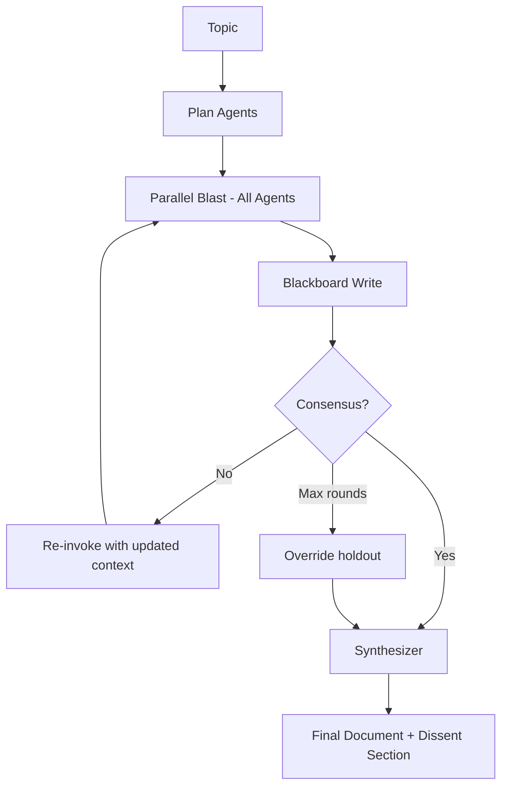

# Blitz-Swarm

**A parallel multi-agent architecture for consensus-driven research synthesis, implementing G-Memory's three-tier hierarchical memory and dissent-preserving convergence.**

## Abstract

Blitz-Swarm is a multi-agent research system where all agents execute simultaneously, share memory through a live blackboard, and iterate toward consensus through voting rounds. Unlike sequential pipelines, Blitz-Swarm fires all agents in parallel and uses a convergence mechanism — unanimous "ready" votes — to determine when the swarm's collective output is sufficient. Dissenting views are explicitly preserved in the final output rather than suppressed. The system implements a three-tier memory architecture inspired by G-Memory (Zhang et al., NeurIPS 2025). It has been run twice; the architecture is functional but not yet validated at scale.

## Research Motivation

Most multi-agent LLM systems use sequential pipelines: Agent A produces output, Agent B consumes it, Agent C refines it. This imposes artificial ordering on tasks that could benefit from simultaneous exploration. Blitz-Swarm investigates whether parallel execution with consensus-based convergence produces different (and potentially better) outputs than sequential approaches.

A secondary question: what happens to minority viewpoints in multi-agent systems? Most architectures force consensus or take majority votes. Blitz-Swarm explicitly preserves dissent, documenting what the holdout agent disagreed about and why.

## Research Questions

- **RQ1:** Does simultaneous agent execution produce qualitatively different output than sequential phasing? *(Not yet tested — no direct comparison with Research Swarm's sequential pipeline on identical topics.)*
- **RQ2:** Does explicit dissent preservation improve output completeness? *(Partially implemented — dissent sections appear in output, but no evaluation of whether they add value.)*
- **RQ3:** How many consensus rounds are needed for convergence? *(Observed: 3 rounds in 1 successful run, with no consensus reached — override was not applied. Insufficient data.)*
- **RQ4:** Does hierarchical memory (G-Memory tiers) improve performance on related topics over time? *(Not yet tested — only 2 runs, memory compounding not observable.)*

## Current Hypotheses

1. **Parallel execution discovers more diverse findings than sequential.** When agents run simultaneously without seeing each other's initial output, they explore independently and produce less correlated findings. *(Design bet — not tested.)*
2. **Consensus-based stopping is more adaptive than fixed rounds.** Instead of running a fixed number of phases, letting agents vote on readiness adapts to topic complexity. *(Observed in 1 run: 3 rounds were insufficient for consensus on "SQLite WAL mode internals." Sample size: 1.)*
3. **Dissent preservation prevents information loss.** Forcing consensus causes minority insights to be averaged out. Preserving dissent keeps potentially valuable alternative perspectives. *(Implemented, not evaluated.)*

## System Overview



### Architecture

| Component | File | Purpose | Status |
|-----------|------|---------|--------|
| Orchestrator | `orchestrator.py` | Main lifecycle: spawn → blast → check → iterate → finalize | **Implemented** |
| Agent Definitions | `agents.py` | 5 roles (researcher, critic, fact-checker, judge, synthesizer) with dynamic count | **Implemented** |
| Consensus | `consensus.py` | Unanimous voting, holdout override after 3 rounds, dissent extraction | **Implemented** |
| Blackboard | `blackboard.py` | Redis-backed shared memory with role-filtered context building | **Implemented** |
| Embedder | `embedder.py` | Sentence-transformers (MiniLM-L6-v2) for semantic similarity | **Implemented** |
| Config | `config.py` | Dataclass-based configuration with TOML loading | **Implemented** |
| G-Memory Tiers 2-3 | — | Task-level semantic graphs, LLM-distilled insights | **Proposed** |
| Memory persistence | — | SQLite + LanceDB for cross-run learning | **Partially implemented** (schema exists, retrieval pipeline not connected) |

### Agent Roles

| Role | Count | Model | Responsibility |
|------|-------|-------|----------------|
| Researcher | 2-6 (dynamic) | Sonnet | Deep-dive assigned subtopics |
| Critic | 1-3 (dynamic) | Sonnet | Flag gaps, contradictions, weak claims |
| Fact-Checker | 0-1 | Sonnet | Cross-validate specific claims |
| Quality Judge | 1 | Sonnet | Score on coverage/accuracy/clarity/depth |
| Synthesizer | 1 | Sonnet | Integrate findings into coherent summary |

Agent count is determined dynamically by an LLM analyzing the topic's complexity, with heuristic fallback.

### Key Mechanisms

| Mechanism | Status | Description |
|-----------|--------|-------------|
| Parallel agent execution | **Implemented** | All agents fire simultaneously via `asyncio.to_thread()` |
| Consensus voting | **Implemented** | Unanimous "ready" votes required; holdout override after 3 rounds |
| Dissent preservation | **Implemented** | Minority viewpoints collected and included in final output |
| Redis blackboard | **Implemented** | Hot-path shared memory with role-filtered context |
| No-Redis fallback | **Implemented** | In-memory blackboard when Redis unavailable |
| Dynamic agent planning | **Implemented** | LLM-based topic analysis determines agent count; heuristic fallback |
| G-Memory Tier 1 (interaction traces) | **Implemented** | Raw agent outputs stored per round |
| G-Memory Tier 2 (semantic graphs) | **Proposed** | Task-level nodes connected by similarity |
| G-Memory Tier 3 (distilled insights) | **Proposed** | Cross-task generalizations |
| Embedding-based retrieval | **Partially implemented** | Embedder exists; retrieval pipeline not connected to orchestrator |

## Evaluation

### Metrics

The judge agent scores each round on 4 dimensions (0-10 scale):

| Metric | Definition |
|--------|-----------|
| Coverage | Breadth of topic coverage |
| Accuracy | Correctness of technical claims |
| Clarity | Readability and coherence of output |
| Depth | Technical depth of analysis |

### Results (2 runs)

| Run | Topic | Rounds | Consensus | Quality | Coverage | Accuracy | Clarity | Depth | Cost | Time |
|-----|-------|--------|-----------|---------|----------|----------|---------|-------|------|------|
| 1 | SQLite WAL mode internals | 3 | No | 7.0 | 6 | 9 | 8 | 5 | $2.26 | 926s |
| 2 | Consensus in distributed systems | 3 | No | 0.0 | 0 | 0 | 0 | 0 | $0.47 | 268s |

**Run 1:** Produced usable output. 16 agent invocations across 3 rounds. No consensus reached (judge never voted "ready"), but synthesizer produced final document. High accuracy (9) but low depth (5) suggests breadth-first exploration.

**Run 2:** Catastrophic failure. Round 1 partially succeeded (3/5 agents), but rounds 2-3 had all 5 agents error. Synthesizer also failed. Root cause: likely context overflow or subprocess errors cascading across rounds.

**Honest assessment:** 2 runs is insufficient to draw any conclusions about system quality. These are existence proofs that the architecture executes, not evidence of effectiveness.

## Failure Modes and Limitations

1. **Extremely limited data.** 2 runs total. No statistical analysis possible. All observations are anecdotal.
2. **Cascading failures.** Run 2 demonstrates that agent errors in early rounds can cascade — if context from round 1 is malformed, all subsequent rounds fail.
3. **No consensus achieved.** Neither run reached unanimous consensus within 3 rounds. The holdout override was never triggered (would require 3+ rounds with a single dissenter while others agree). The convergence mechanism is implemented but unvalidated.
4. **Memory pipeline incomplete.** G-Memory Tier 1 (interaction traces) is stored, but Tiers 2-3 (semantic graphs, distilled insights) are proposed only. Cross-run learning does not function.
5. **Single model family.** All agents use Claude. Behavior with other LLMs is unknown.
6. **Redis dependency.** The blackboard works best with Redis. The no-Redis fallback exists but may behave differently under load.
7. **No comparison baseline.** No runs of the same topics on a sequential pipeline (Research Swarm) for direct comparison.
8. **Cost.** Run 1 cost $2.26 for 16 agent invocations across 3 rounds. At this rate, extended consensus (5 rounds, more agents) could be expensive.

## Reproducibility

### Requirements
- Python 3.12+
- [Claude Code CLI](https://docs.anthropic.com/en/docs/claude-code) installed and authenticated
- Redis (optional): `docker run -d --name blitz-redis -p 6379:6379 redis:7-alpine`
- `pip install redis aiosqlite lancedb sentence-transformers`

### Run a topic
```bash
# Without Redis
python orchestrator.py "your topic" --no-redis

# With Redis
python orchestrator.py "your topic"

# Preview agent plan
python orchestrator.py "your topic" --dry-run

# Limit rounds
python orchestrator.py "your topic" --max-rounds 3
```

### Known Sources of Nondeterminism
- LLM output varies between runs
- Dynamic agent planning produces different agent counts
- Redis state may persist between runs if not cleared
- Subprocess timing affects timeout boundaries

### Environment Assumptions
- macOS or Linux
- Internet access not required (no web search — unlike Research Swarm)
- No GPU required (MiniLM embeddings run on CPU)
- Runs take 4-16 minutes depending on agent count and round count

## Repo Structure

```
blitz-swarm/
├── orchestrator.py         # Main lifecycle: spawn → blast → check → finalize
├── agents.py               # 5 agent roles, dynamic planning, topic decomposition
├── consensus.py            # Convergence voting, holdout override, dissent preservation
├── blackboard.py           # Redis-backed shared memory, role-filtered context
├── embedder.py             # Sentence-transformers wrapper (MiniLM-L6-v2)
├── config.py               # Configuration dataclasses, TOML loading
├── blitz.toml              # Runtime configuration
├── pyproject.toml           # Package metadata, dependencies
├── metrics.jsonl            # Per-run metrics (2 entries)
├── BLITZ-SWARM.md           # Detailed architecture specification
├── Memory architecture...md # Literature review: parallel agent memory design
├── Building Hierarchical...md # Literature review: G-Memory blueprint
├── memory/                  # Empty — planned for memory persistence artifacts
├── output/                  # Generated research documents (gitignored)
└── memory.db                # SQLite database (gitignored)
```

## Design Principles

- **No sequential waves.** All agents fire simultaneously, not in phases.
- **No frameworks.** Vanilla Python + asyncio + subprocess. No LangGraph, no CrewAI.
- **Model-agnostic.** Any CLI-invocable model works as an agent backend.
- **Privacy-first.** All memory is local. No telemetry. No external APIs beyond the model.
- **Dissent over consensus.** Minority views are preserved, not suppressed.

## Relationship to Other Projects

Blitz-Swarm is the predecessor to [Research Swarm](https://github.com/Joona-t/research-swarm). Research Swarm adopted a sequential pipeline (scout → research → applied → quality gate → synthesis) after observing that research tasks have real information dependencies that parallel execution ignores. Both projects share the same agent invocation pattern (stateless `claude -p` subprocesses) and G-Memory design.

The [Swarm Builder](https://github.com/Joona-t/swarm-builder-claude-cli-skill) CLI skill applies findings from Research Swarm to browser extension development.

## Citation

```bibtex
@software{tyrninoksa2026blitzswarm,
  author = {Tyrninoksa, Joona},
  title = {Blitz-Swarm: Parallel Multi-Agent Consensus Architecture},
  year = {2026},
  url = {https://github.com/Joona-t/blitz-swarm},
  license = {MIT}
}
```

This is an independent research artifact by a solo developer. It is not affiliated with any institution or research lab.

## License

MIT
